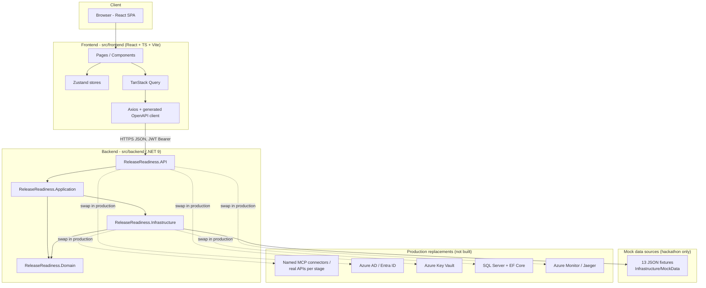
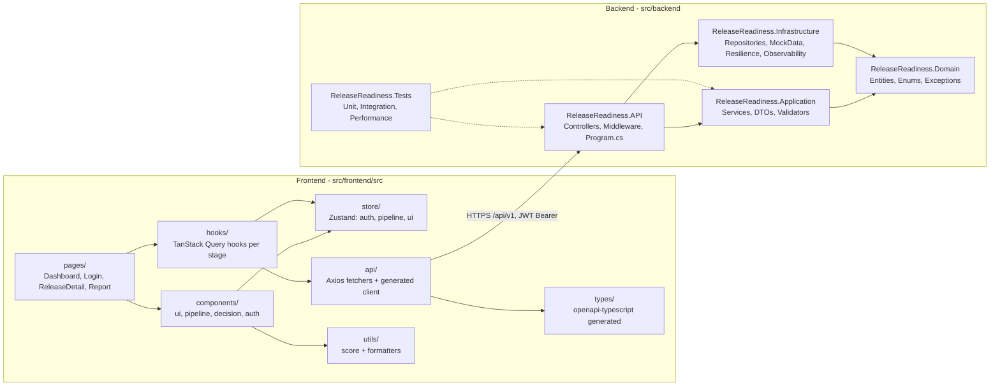
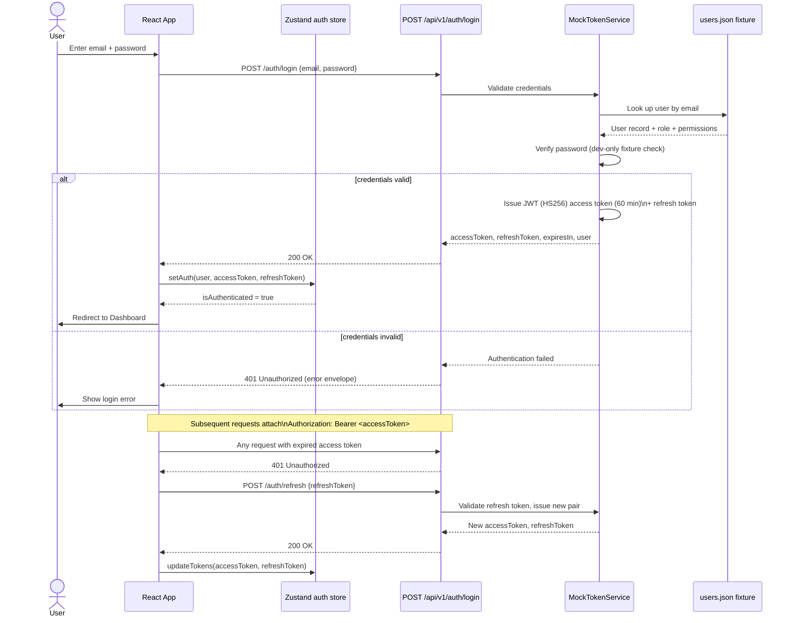
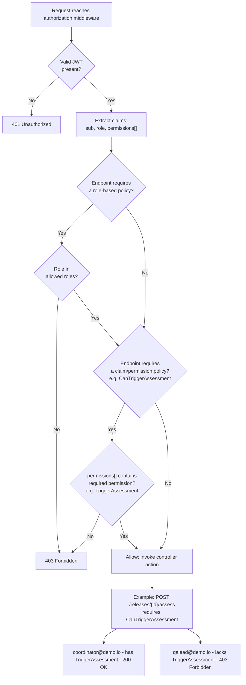
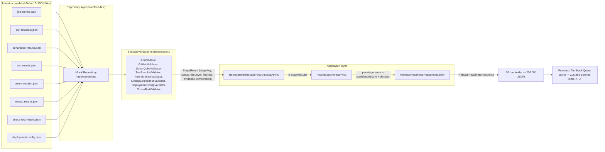
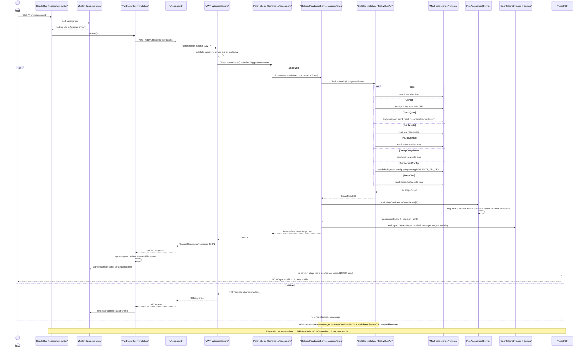
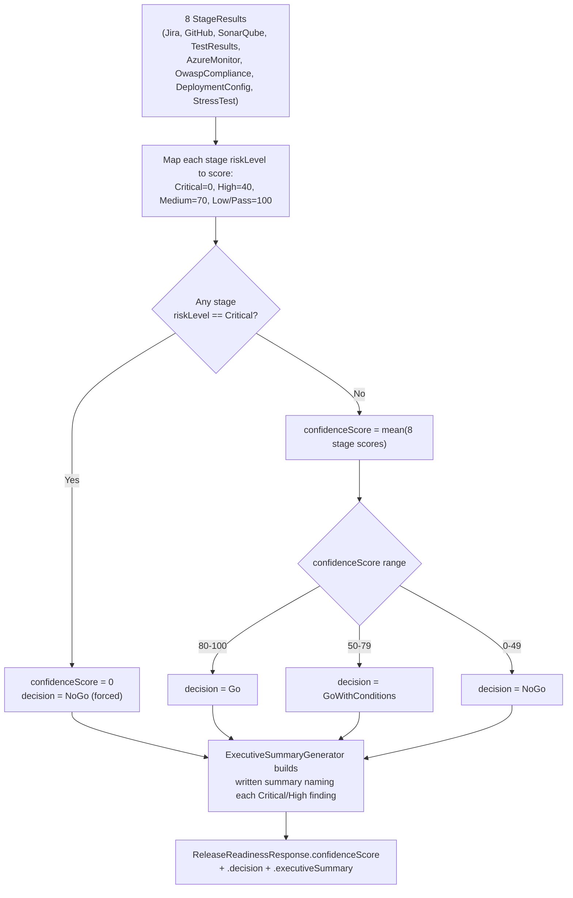

# Architecture

This document is the single source of truth for how Release Readiness AI Assistant fits together. It covers solution architecture, component layering, request flow, auth, data flow, the full vertical slice, and confidence score maths. All 8 diagrams required by the build spec are below.

> Note on stage count: earlier planning notes referenced "7 pipeline stages". The team resolved this at kickoff to **8 stages** (Jira, GitHub, SonarQube, TestResults, AzureMonitor, OwaspCompliance, DeploymentConfig, StressTest). This document and all other docs use 8 as the authoritative count.

## 1. Solution architecture diagram

## 2. Component diagram (frontend + backend layers)

## 3. API flow diagram

```mermaid
flowchart LR
    Req["Incoming HTTP request"] --> Cors["CORS middleware"]
    Cors --> Sec["Security headers middleware"]
    Sec --> Corr["Correlation ID middleware"]
    Corr --> Log["Request/response logging middleware"]
    Log --> RateLimit["Rate limiting (100 req/min/user)"]
    RateLimit --> AuthN["JWT authentication middleware"]
    AuthN --> Ver["API version resolution (Asp.Versioning.Http, default v1)"]
    Ver --> AuthZ["Policy/claims authorization\n(e.g. CanTriggerAssessment)"]
    AuthZ --> Ctrl["Versioned controller action"]
    Ctrl --> Val["FluentValidation"]
    Val -- "valid" --> Svc["Application service"]
    Val -- "invalid" --> Err422["422 Unprocessable Entity\nerror envelope"]
    Svc --> Repo["Infrastructure repository (mock fixtures)"]
    Repo --> Svc
    Svc --> Resp["ReleaseReadinessResponse / DTO"]
    Resp --> ExMw["Global exception middleware\n(catches unhandled errors)"]
    ExMw --> Out["200 OK response\ncorrelationId in header"]
    AuthN -- "no/invalid token" --> Err401["401 Unauthorized"]
    AuthZ -- "missing permission" --> Err403["403 Forbidden"]
```

## 4. Authentication flow

## 5. Authorization / policy flow

## 6. Data flow (mock fixture to service to response)

## 7. Sequence diagram - full vertical slice (button click to UI update)

## 8. Confidence score calculation flow

### Worked example - scripted demo dataset

| Stage | Status | Risk level | Score |
|---|---|---|---|
| Jira | Pass | Low | 100 |
| GitHub | Fail | **Critical** | 0 |
| SonarQube | Pass | Low | 100 |
| TestResults | Pass | Low | 100 |
| AzureMonitor | Pass | Low | 100 |
| OwaspCompliance | Pass | Low | 100 |
| DeploymentConfig | Fail | **Critical** | 0 |
| StressTest | Pass | Low | 100 |

Two stages are Critical, so the mean is never computed. `confidenceScore = 0`, `decision = NoGo`. The executive summary names both blockers: the unmerged hotfix PR #482 against `release/2.14`, and the missing `PAYMENTS_API_KEY` deployment config value.

---

## Production Readiness Checklist

Before this moves beyond a hackathon demo, all of the following must be true:

- [ ] All 8 mock fixtures replaced with named MCP connectors or real APIs (see `TECHNICAL_DEBT.md` for the 1:1 mapping)
- [ ] Mock JWT (`MockTokenService`) replaced with Azure AD / Entra ID (OAuth2 / OIDC, MSAL on the frontend)
- [ ] Secrets moved from `appsettings.*.json` / dev fixtures to Azure Key Vault
- [ ] In-memory repository replaced with a real database (SQL Server + EF Core)
- [ ] OpenTelemetry exporter pointed at a production backend (Azure Monitor or Jaeger) instead of console/local exporter
- [ ] Rate limiting thresholds tuned for real production load (currently 100 req/min/user, hackathon default)
- [ ] CORS restricted to the production frontend domain (no wildcard origins)
- [ ] Security headers validated with a header-scanning tool (CSP, X-Frame-Options, X-Content-Type-Options, Referrer-Policy, Permissions-Policy)
- [ ] Penetration test completed and findings remediated
- [ ] k6 load test executed against a staging environment (not just the CI smoke test)
- [ ] All `// MOCK:` comments, TODOs, and placeholder services (`NoOpCacheService`, `NoOpEventPublisher`) resolved or intentionally deferred with a tracked ticket

## Known Assumptions

- All 8 pipeline stages (Jira, GitHub, SonarQube, TestResults, AzureMonitor, OwaspCompliance, DeploymentConfig, StressTest) are mocked as JSON fixtures representative of real release data, not live calls.
- The MCP (Model Context Protocol) integration pattern is documented and demo-able as an architecture diagram (see diagram 1 above) but is **not implemented** - no MCP server exists in this codebase.
- Each mock fixture maps 1:1 to a named production MCP connector or API endpoint (see `TECHNICAL_DEBT.md`).
- The JWT signing secret in `appsettings.Development.json` is a development-only value. Production must source it from Key Vault and never commit it.
- No real external network calls are made during the hackathon demo. Every stage validator reads local JSON fixtures.
